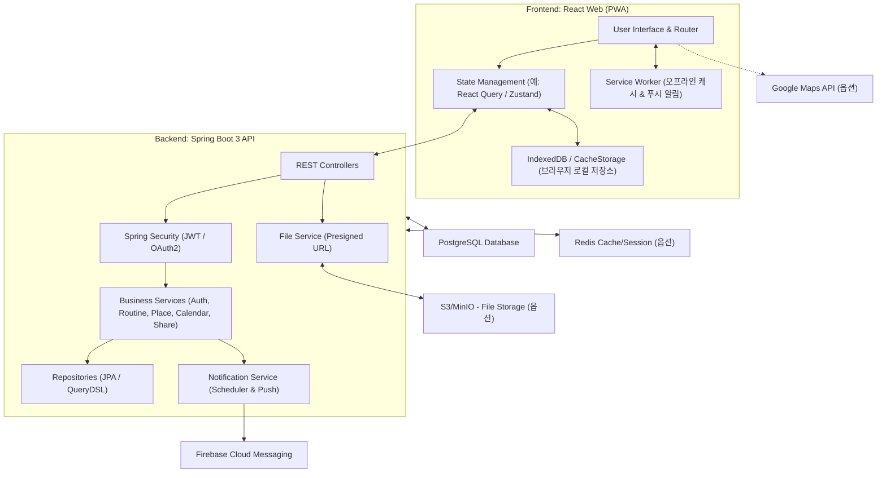

```mermaid
flowchart TB
  subgraph frontend["Frontend: React Web (PWA)"]
    ui["User Interface & Router"]
    state["State Management (예: React Query / Zustand)"]
    sw["Service Worker (오프라인 캐시 & 푸시 알림)"]
    idb["IndexedDB / CacheStorage (브라우저 로컬 저장소)"]
    ui --> state
    state <--> idb
    ui <--> sw
  end

  subgraph backend["Backend: Spring Boot 3 API"]
    ctrl["REST Controllers"]
    sec["Spring Security (JWT / OAuth2)"]
    svc["Business Services (Auth, Routine, Place, Calendar, Share)"]
    repo["Repositories (JPA / QueryDSL)"]
    file["File Service (Presigned URL)"]
    noti["Notification Service (Scheduler & Push)"]
    ctrl --> sec --> svc --> repo
    ctrl --> file
    svc --> noti
  end

  db["PostgreSQL Database"]
  redis["Redis Cache/Session (옵션)"]
  s3["S3/MinIO - File Storage (옵션)"]
  fcm["Firebase Cloud Messaging"]
  maps["Google Maps API (옵션)"]

  state <--> ctrl
  backend <--> db
  backend <--> redis
  file <--> s3
  noti --> fcm
  ui -.-> maps
```
