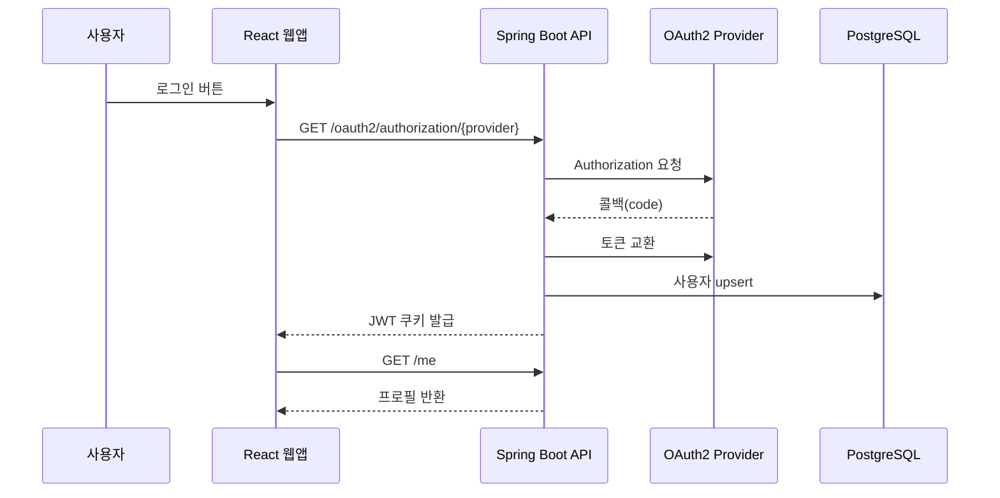
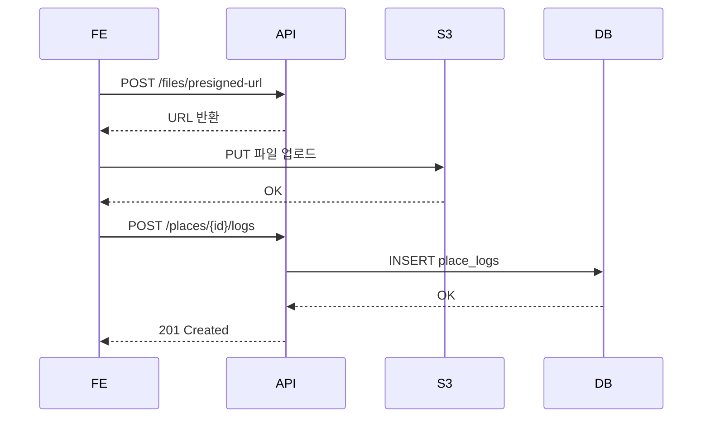
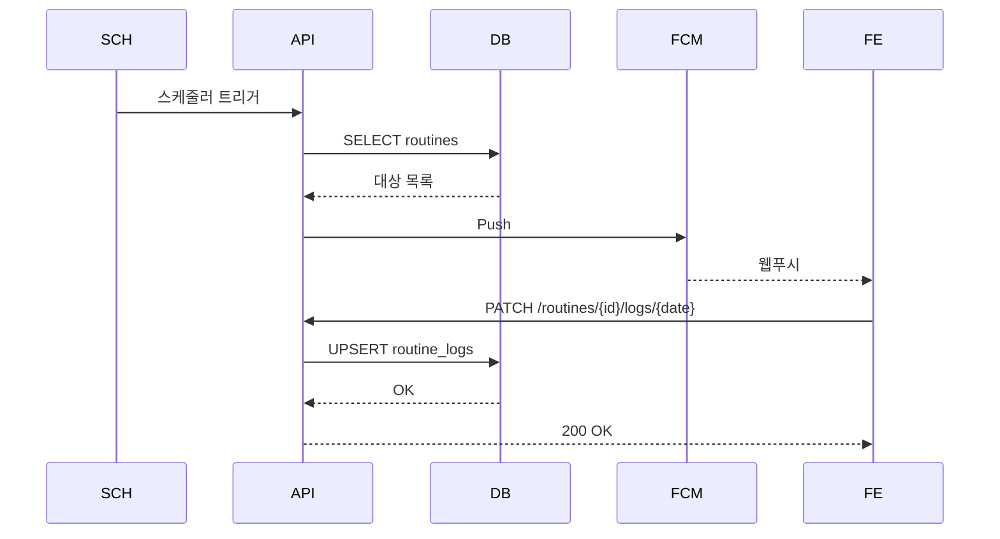

소셜 로그인 (OAuth2 → JWT 발급)

```mermaid
sequenceDiagram
  participant U as 사용자
  participant FE as React 웹앱
  participant API as Spring Boot API
  participant OP as OAuth2 Provider
  participant DB as PostgreSQL
  U->>FE: 로그인 버튼
  FE->>API: GET /oauth2/authorization/{provider}
  API->>OP: Authorization 요청
  OP-->>API: 콜백(code)
  API->>OP: 토큰 교환
  API->>DB: 사용자 upsert
  API-->>FE: JWT 쿠키 발급
  FE->>API: GET /me
  API-->>FE: 프로필 반환
```

장소 기록 + 이미지 업로드 (Presigned URL)

```mermaid
sequenceDiagram
  FE->>API: POST /files/presigned-url
  API-->>FE: URL 반환
  FE->>S3: PUT 파일 업로드
  S3-->>FE: OK
  FE->>API: POST /places/{id}/logs
  API->>DB: INSERT place_logs
  DB-->>API: OK
  API-->>FE: 201 Created
```

루틴 알림 발송 & 체크

```mermaid
sequenceDiagram
  SCH->>API: 스케줄러 트리거
  API->>DB: SELECT routines
  DB-->>API: 대상 목록
  API->>FCM: Push
  FCM-->>FE: 웹푸시
  FE->>API: PATCH /routines/{id}/logs/{date}
  API->>DB: UPSERT routine_logs
  DB-->>API: OK
  API-->>FE: 200 OK
```
